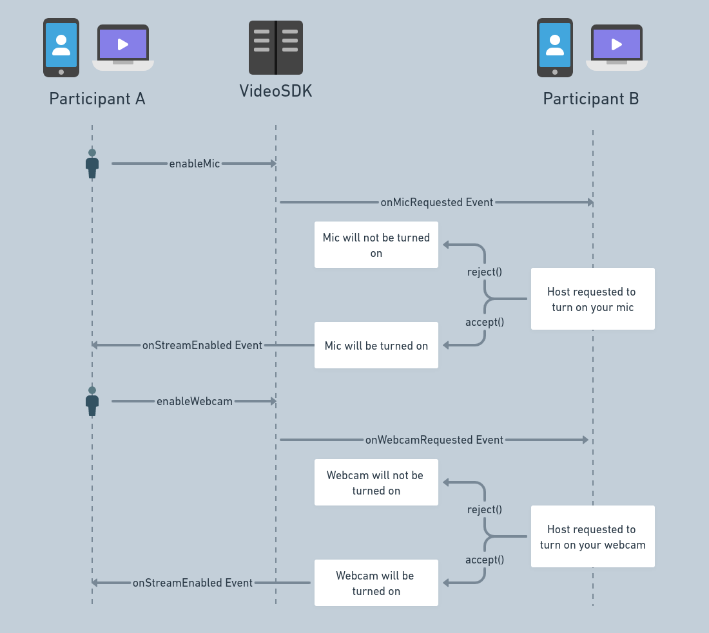

# Toggle Remote Participant Media - Android

When hosting a meeting, it's important that the host of the meeting should be able to request someone's Mic or Camera to be turned on or should be able to turn them off.

:::note
Participant who will be controlling other participant's mic and camera should have permission **`allow_mod`** passed in the token. To know more about permissions [**visit here**](/android/guide/video-and-audio-calling-api-sdk/authentication-and-token).
:::

Before we discuss the methods and events associated with this functionality, here is how the flow would look like.



## Methods

### `enableMic()`

- If you wish to turn **on** the microphone of a participant, you will be calling the `enableMic()` from the `Participant` class.

- When this method is called, the participant whose microphone is requested will receive the `onMicRequested` event with the `participantId` of the participant who requested it and two callback functions `accept` and `reject` which should be called based on decision made by the user.

- **Example:** Meeting is running with **Participant A** and **Participant B**. Now **Participant A** wants to Enable Mic of **Participant B**, so **Participant A** will use `enableMic()` function to request **Participant B**, after that **Participant B** recieve the `onMicRequested` event, from there user can either accept or reject the incoming request.

### `enableWebcam()`

- If you wish to turn **on** the camera of a participant, you will be calling the `enableWebcam()` from the `Participant` class.

- When this method is called, the participant whose camera is requested will receive the `onWebcamRequested` event with the `participantId` of the participant who requested it and two callback functions `accept` and `reject` which should be called based on decision made by the user.

- **Example:** Meeting is running with **Participant A** and **Participant B**. Now **Participant A** wants to Enable Webcam of **Participant B**, so **Participant A** will use `enableWebcam()` function to request **Participant B**, after that **Participant B** recieve the `onWebcamRequested` event, from there user can either accept or reject the incoming request.

### `disableMic()`

- If you wish to turn **off** the microphone of a participant, you will be calling the `disableMic()` from the `Participant` class.
- This will disable the microphone of the participant.

### `disableWebcam()`

- If you wish to turn **off** the camera of a participant, you will be calling the `disableWebcam()` from the `Participant` class.
- This will disable the camera of the participant.

#### Example

import Tabs from '@theme/Tabs';
import TabItem from '@theme/TabItem';

<Tabs
defaultValue="Kotlin"
groupId={"AndroidLanguage"}
values={[{label: 'Kotlin', value: 'Kotlin'},{label: 'Java', value: 'Java'},]}>

<TabItem value="Kotlin">

```js
btnEnableWebcam!!.setOnClickListener { _: View? ->
  // This will emit an event called "onWebcamRequested" to that particular participant
  participant!!.enableWebcam()
}

btnEnableMic!!.setOnClickListener { _: View? ->
  // This will emit an event called "onMicRequested" to that particular participant
  participant!!.enableMic()
}

btnDisableWebcam!!.setOnClickListener { _: View? ->
  // This will disable the webcam of that particular participant
  participant.disableWebcam()
}

btnDisableWebcam!!.setOnClickListener { _: View? ->
  // This will disable the mic of that particular participant
  participant.disableMic()
}
```

</TabItem>

<TabItem value="Java">

```js
btnEnableWebcam.setOnClickListener(new View.OnClickListener() {
    @Override
    public void onClick(View v) {
      // This will emit an event called "onWebcamRequested" to that particular participant
      participant.enableWebcam();
    }
});

btnEnableMic.setOnClickListener(new View.OnClickListener() {
    @Override
    public void onClick(View v) {
      // This will emit an event called "onMicRequested" to that particular participant
      participant.enableMic();
    }
});

btnDisableWebcam.setOnClickListener(new View.OnClickListener() {
    @Override
    public void onClick(View v) {
      // This will disable the webcam of that particular participant
      participant.disableWebcam();
    }
});

btnDisableMic.setOnClickListener(new View.OnClickListener() {
    @Override
    public void onClick(View v) {
      // This will disable the mic of that particular participant
      participant.disableMic();
    }
});
```

</TabItem>

</Tabs>

## Events

### `onWebcamRequested`

This event will be emitted to the `Participant B` when any other `Participant A` requests to enable webcam of that participant (`Participant B`). This event handler will receieve following two arguments:

- `participantId` - ParticipantId of the requesting participant
- `listener`: MicRequestListener { accept: Method; reject: Method }

### `onMicRequested`

This event will be emitted to the `Participant B` when any other `Participant A` requests to enable mic of that participant (`Participant B`). This event handler will receieve following two arguments:

- `participantId` - ParticipantId of the requesting participant
- `listener`: MicRequestListener { accept: Method; reject: Method }

###### Usage

<Tabs
defaultValue="Kotlin"
groupId={"AndroidLanguage"}
values={[{label: 'Kotlin', value: 'Kotlin'},{label: 'Java', value: 'Java'},]}>

<TabItem value="Kotlin">

```javascript
override fun onMicRequested(participantId: String, listener: MicRequestListener) {
  // callback function to accept the request
  listener.accept()

  // callback function to reject the request
  listener.reject()
}

override fun onWebcamRequested(participantId: String, listener: WebcamRequestListener) {
  // callback function to accept the request
  listener.accept()

  // callback function to reject the request
  listener.reject()
}
```

</TabItem>

<TabItem value="Java">

```javascript
@Override
public void onMicRequested(String participantId, MicRequestListener listener) {
  // callback function to accept the request
  listener.accept();

  // callback function to reject the request
  listener.reject();
}

@Override
public void onWebcamRequested(String participantId, WebcamRequestListener listener) {
  // callback function to accept the request
  listener.accept();

  // callback function to reject the request
  listener.reject();
}
```

</TabItem>

</Tabs>

## API Reference

The API references for all the methods and events utilised in this guide are provided below.

- [enableMic()](/android/api/sdk-reference/participant-class/methods#enablemic)
- [disableMic()](/android/api/sdk-reference/participant-class/methods#disablemic)
- [enableWebcam()](/android/api/sdk-reference/participant-class/methods#enablewebcam)
- [disableWebcam()](/android/api/sdk-reference/participant-class/methods#disablewebcam)
- [onMicRequested()](/android/api/sdk-reference/meeting-class/meeting-event-listener-class#onmicrequested)
- [onWebcamRequested()](/android/api/sdk-reference/meeting-class/meeting-event-listener-class#onwebcamrequested)
